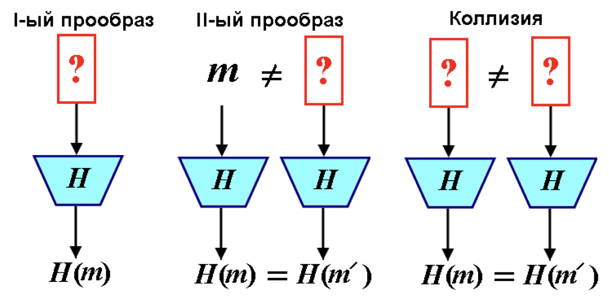

# Криптографические хеш-функции

**Функция хэширования** $H(m)$ или **хэш-функция** (hash-function) – это детерминированная функция, на вход которой подается строка битов произвольной длины, а выходом *всегда* является битовая строка фиксированной длины n.

Исходная строка m, для которой вычислено хэш-значение, называется *прообразом хэш-функции*.

Свойства, которые должны быть присущи криптографическим хэш-функциям:

1. Стойкость к поиску первого прообраза – отсутствие эффективного полиномиального алгоритма вычисления обратной функции, т.е. нельзя восстановить текст m по известной его свертке $H(m)$ за реальное время (необратимость). Это свойство эквивалентно тому, что хэш-функция является односторонней функцией.
2. Стойкость к поиску второго прообраза (коллизиям первого рода) – вычислительно невозможно, зная сообщение m и его свертку $H(m)$ , найти такое другое сообщение $m' \neq m$ , чтобы $H(m) = H(m')$.
3. Стойкость к коллизиям (коллизиям второго рода) – Коллизией для хэш-функции называется такая пара значений $m$ и $m'$, $m \neq m'$ , для которой $H(m) = H(m')$. Так как количество возможных открытых текстов больше числа возможных значений свертки, то для некоторой свертки найдется много прообразов ⇒ коллизии для хэш-функций обязательно существуют. Например, пусть длина хэш-прообраза 6 битов, длина свертки 4 бита. Тогда число различных сверток – $2^4 = 16$, а число хэш-прообразов – $2^6 = 64$, т.е. в 4 раза больше ⇒ хотя бы одна свертка из всех соответствует 4 прообразам.

**Стойкость хэш-функции к коллизиям** означает, что нет эффективного полиномиального алгоритма, позволяющего находить коллизии.
*Замечание*: свойства не являются независимыми:
• Обратимая функция неустойчива к восстановлению второго прообраза и коллизиям.
• Функция, нестойкая к восстановлению второго прообраза, нестойка к коллизиям; обратное неверно.
• Функция устойчивая к коллизиям, устойчива к нахождению второго прообраза.
• Устойчивая к коллизиям хэш-функция не обязательно является односторонней.
Для криптографии важно, чтобы значения хэш-функции сильно
изменялись при малейшем изменении аргумента, т.е. ей должен быть присущ *лавинный эффект*.
Значение хеша не должно давать утечки информации даже об отдельных битах аргумента.
