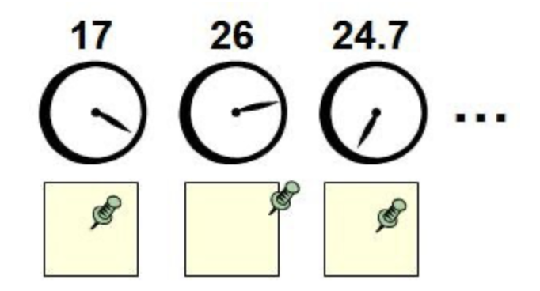

# Постквантовая криптография

## Введение

Из года в год квантовые компьютеры становятся все более производительными и дешевыми в производстве - например, Zuchongzi использует 56 кубита и способен решать задачи, предполагающие возможность квантового ускорения, за несколько часов, в то время как классические суперкомпьютеры требуют нескольких десятков тысяч лет. На данный момент обычному пользователю даже доступна работа на реальном квантовом компьютере IBM, пусть и с ограничением в несколько кубит. Большинство современных криптосистем основаны на сложности факторизации целых чисел и дискретного логарифмирования классическими алгоритмами, но данные задачи легко решаются с использованием алгоритма Шора. Одни из самых популярных криптографических систем – RSA (факторизация целых чисел), DH (дискретное логарифмирование), и ECDSA (эллиптические кривые над конечными полями) – с приходом достаточно производительных квантовых компьютеров перестанут являться надежным средством шифрования данных. В данной статье мы рассмотрим, каким образом квантовые компьютеры решают задачи, используемые в современных криптографических системах, и какие существуют пост-квантовые криптографические системы. Эта статья подразумевает наличия у читателя базового понимания физических основ квантовых вычислений.

## Алгоритм Шора

Квантовый алгоритм Шора позволяет выполнить факторизацию числа M за время $O(log^3 M)$,используя $O(logM)$ кубитов. При использовании квантового компьютера с несколькими тысячами кубитов становится возможным взлом криптографических систем с открытым ключом (например, RSA, использующий открытый ключ, являющийся произведением двух больших простых чисел). Одним из методов взлома таких систем является как раз разложение открытого ключа на простые множители. Классические алгоритмы для обычных компьютеров позволяют произвести взлом такой системы за время $O(M^{\frac{1}{4}})$. Алгоритм Шора же способен произвести взлом не просто за полиномиальное время, а за время, сравнимое со временем умножения простых чисел.
Чтобы не нагружать статью математическими выкладками, я опишу принцип работы этого алгоритма простыми словами, но вы можете ознакомиться с полным описанием на соответствующей странице Википедии.

### Принцип работы

Алгоритм Шора, как и многие другие квантовые алгоритмы, состоит из непосредственно квантовой части и классической части, выполняемой на обычном компьютере. Квантовая часть алгоритма Шора заключается в поиске периода некой функции, который выполняется с помощью квантового преобразования Фурье (QFT). Суть его работы покажем на аналогии. Представим, что есть человек, живущий не 24-часовой день, а, например, 26-часовой. Нам нужно определить, сколько именно часов в сутках у этого человека. В его спальне есть большое количество настенных часов, каждые из которых делают полный оборот за определенное количество времени (одни за 15 за, другие за 17 и так далее, для простоты будем считать, что минутной стрелки нет). Под каждыми часами есть лист, в середине которого прикреплена канцелярская кнопка.

Каждое утро человек встает и переставляет эту кнопку на один сантиметр в направлении стрелки соответствующих часов. Спустя достаточное количество времени мы можем понять, сколько именно часов в сутках у этого человека – на часах, делающих полный оборот за 26 часов, кнопка будет смещена на значительное расстояние от центра, так как каждое утро стрелка этих часов указывает в одном направлении, все же кнопки под остальными часами будут находиться в окрестности центра листа. Таким образом, мы узнали период функции пробуждения этого человека. QFT работает аналогичным образом и может быть эффективно применено на квантовом компьютере, так как он позволяет иметь несколько кубитов (“настенных часов” в рамках описанного выше эксперимента) в состоянии суперпозиции и производить операции над ними одновременно. Амплитуда $|1\rangle$ состояний кубитов, соответствующих искомому периоду, будет расти ввиду интерференции, остальных же сохраняться около нуля (так как изначально все кубиты выставляются в нулевое булево состояние $|0\rangle$.
Теперь перейдем к классической части алгоритма Шора. Допустим, мы хотим факторизовать числоN. Для этого мы берем случайное числоaи ищем период\omegaфункции $f(x) = a^{x}modN$.В результате получим, что наибольшим делителемNбудет число $a^{\frac{\omega}{2}} - 1$
Стоит заметить, что не всегда случайный выбор числаaприводит к получению делителейN.В таком случаеaвыбирается еще раз, и с большой долей вероятности делительNбудет найден после проверки небольшого количества значений $a$.

## Постквантовая криптография и ее виды

Преимуществами квантовых вычислений не позволят воспользоваться постквантовые алгоритмы – они используют в своей основе задачи, которые сложно решить и обычным, и квантовым компьютерам. Не стоит путать постквантовую и квантовую криптографию – вторая пользуется законами квантовой механики для отправки сообщений, и взломать квантовые системы невозможно. В постквантовой криптографии выделяется 5 различных подходов, исключающих возможность квантовых атак:

- Криптография, основанная на хеш-функциях
- Криптография, основанная на кодах исправления ошибок
- Криптография, основанная на решётках
- Криптография, основанная на многомерных квадратичных системах
- Шифрование с секретным ключом
- Шифрование с использованием суперсингулярной изогении

Рассмотрим наиболее перспективные из них. Часть подходов рассматривать не будем в силу их сложности для понимания.

### Криптография, основанная на хеш-функциях

Классическим примером такого подходя является подпись Меркла – алгоритм многоразовой цифровой подписи, основанный на использовании дерева Меркла, и любой одноразовой подписи, основанной на криптостойкой хеш-функции.

Принцип работы алгоритма состоит из 3 шагов:

1. Генерируются массивы секретных ключей $X$ и публичных $Y$. Пары $(X_{i}; Y_{i})$ используются как пары открытый-закрытый ключ для одноразовой подписи. Для генерации $Y$ используется дерево Меркла: для каждого $Y_{i}$ c использованием криптостойкой хэш-функции $H$ вычисляется $H(Y_{i})$– нулевой слой дерева $a_{0}$.Каждый следующий слой вычисляется как $H(a_{i, 2n} || a_{i, 2n+1})$ (где $||$- конкатенация) до того момента, пока в слое не останется один ключ, который называется открытым и обозначается $pub\_key$
2. Для генерации подписи выбирается пара ключей $(X_i;Y_i)$. Для сообщения $d$ вычисляется одноразовая подпись $b$, а также вычисляется путь от $Y_i$ до корня дерева. В подпись входит верификационный ключ $Y_i$, подпись $b$ и путь до корня дерева
3. Проверка подписи производится в 2 этапа: сначала получатель проверяет соответствие подписи $b$ сообщению $d$. Если проверка пройдена, строится путь $H(Y_i)$ до корня дерева. При совпадении полученного корня дерева с $pub\_key$ проверка подписи считается успешной

В отличие от алгоритмов наподобие RSA, подпись Меркла является постквантовой, так как опирается на стойкость криптографической хеш-функции $H$ и одноразовой подписи. Существенным недостатком данного алгоритма и схожих, основанных на хеш-функциях, является ограниченное количество подписей, используемых один раз для каждого сообщения, что препятствует массовому использованию такого подхода. Однако уже существуют методы создания аналогичным способом многоразовых подписей.

### Криптография, основанная на кодах исправления ошибок

Одним из примеров таких систем является McEliece – криптосистема с открытыми ключами, основанная на сложности декодирования полных линейных кодов и использующая в процессе шифрования элемент случайности. В этой системе всеми пользователями совместно используются параметры безопасности $n, k, t$. На данный момент предложено использование следующего набора параметров: $n = 2048, k = 1751, t = 27$, при этом размер открытого ключа достигает 520.047 бит. Для устойчивости против квантовых атак предлагается использовать $n = 6960, k = 5413, t = 119$, размер открытого ключа в этом случае достигает 8.373.911 бит. Главными недостатками систем наподобие McEliece являются большой размер открытого ключа и значительное увеличение длины зашифрованного сообщения в сравнении с исходным. Однако такой подход в постквантовой криптографии считается одним из наиболее перспективных ввиду отсутствия серьезных недостатков (вроде ограниченного количества подписей) и деактулизации проблемы размеров передаваемых сообщений на фоне увеличивающихся скоростей передачи данных.

### Криптография, основанная на многомерных квадратичных системах

Наиболее популярным примером такого подходя является стандарт AES (англ. Advanced Encryption Standard) – симметричный алгоритм блочного шифрования, используемый правительством США как достаточно надежный для защиты информации, являющейся государственной тайной.

#### Принцип работы AES

Сообщения при использовании AES разбиваются на блоки по 128 бит, ключ при этом может быть размером в 128, 192 или 256 бит. В 128-битовый блок вмещается 16 байт, запишем в него сообщение “котики очень милые”. Последние два символа будут переданы в следующем блоке, мы рассмотрим только первый.
